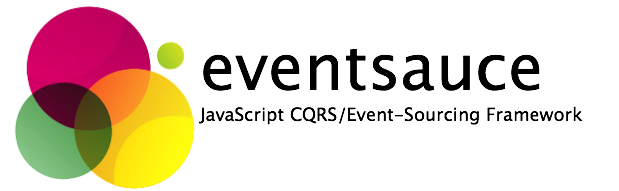

# eventsauce
**eventsauce** is an event-sourcing/CQRS Framework in Javascript, 
using ES6. The goal of the project is to make domain-driven
design concepts easy to apply in a repeatable, consistent way
for NodeJS applications.

## Contributions
If you wish to contribute to **eventsauce** then please create an
issue to discuss the change or a pull request. Generally it's better
to raise an issue first, as unannounced pull requests may not
align to various long term goals. Particularly welcome are new
modules for:

  * Event Store support - Adding support for new back-end event streams.
  * Message Bus support - Modules for event buses, such as Kafka.
 
## Licensing
Code is presently licensed as GPLv2, and may be used freely. 

